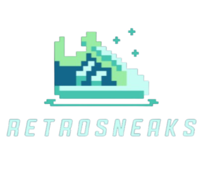

# 👟 RetroSneaks

A modern sneaker e-commerce website built with HTML, CSS and JavaScript, featuring product browsing, user authentication, cart management and a checkout flow.

## 📸 Preview



## ✨ Features

### 👟 Sneaker Collections

Browse sneakers across multiple collections:

- Travis Scott
- Nike Dunks
- Air Jordans
- Air Force 1
- Adidas

### 🛍️ Product Pages

Each sneaker includes a dedicated product view with product information, pricing and an option to add the item to the cart.

### 🛒 Shopping Cart

The cart system allows users to:

- Add products
- Change quantities
- Remove products
- View subtotal and total price
- Continue to checkout

Cart information is persisted using browser `localStorage`.

### 👤 User Authentication

RetroSneaks includes a client-side login and registration system.

User information and the currently logged-in session are managed using `localStorage`.

### 💳 Checkout & Payment

Users must be logged in before proceeding to checkout.

The checkout flow stores order information and redirects the user to a dedicated payment page containing a UPI/QR-based payment interface.

### 📱 Responsive Interface

The website is designed to adapt across different screen sizes while maintaining a sneaker-focused shopping experience.

## 🛠️ Technologies

- HTML5
- CSS3
- JavaScript
- Browser LocalStorage

## 📁 Project Structure

```text
RetroSneaks/
├── Adidas/
├── Air Force/
├── Dunks/
├── Jordans/
├── Travis Scott/
│
├── retrosneaks.html
├── products.html
├── cart.html
├── payment.html
├── info.html
│
├── RetroSneaks.png
├── payment-methods.jpg
├── upi-qr.png
└── other image assets
```

## 🚀 Getting Started

Clone the repository:

```bash
git clone https://github.com/adithhn12/RetroSneaks.git
```

Open the project folder and launch:

```text
retrosneaks.html
```

in a web browser.

No package installation or backend server is required.

## 🔄 Application Flow

```text
Home
  ↓
Browse Collection
  ↓
Product Details
  ↓
Add to Cart
  ↓
Cart
  ↓
Login / Register
  ↓
Checkout
  ↓
Payment
```

## 🎯 Project Goal

RetroSneaks was developed to explore front-end e-commerce development using vanilla web technologies.

The project demonstrates product presentation, client-side state management, authentication flow, cart functionality and a basic checkout experience without relying on a frontend framework.

## 🔮 Future Improvements

- Backend-based authentication
- Database integration
- Secure payment gateway integration
- Product search and filtering
- Wishlist functionality
- Order history
- Admin dashboard
- Inventory management

## 📌 Note

RetroSneaks is a front-end educational project. Authentication, order data and cart information are currently stored client-side using browser LocalStorage.

Payment functionality is a demonstration interface and is not intended to function as a production payment system.
